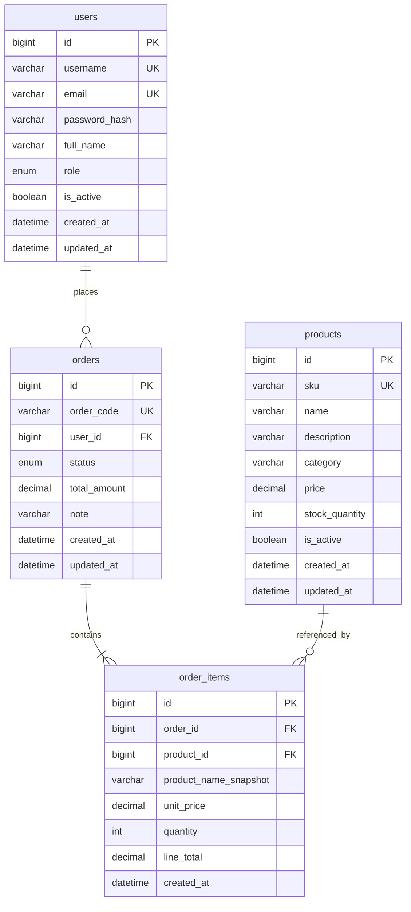

# Redis Shop Demo Database

MySQL database cho phần dữ liệu bền vững của hệ thống demo Redis.

Redis vẫn đảm nhiệm các dữ liệu tạm thời/tốc độ cao:

- Cache: `cache:*`
- Session: `session:*`
- Cart: `cart:*`
- Rate limit: `rate:*`
- Ranking realtime: `ranking:*`
- Streams: `stream:*`
- Pub/Sub: `notifications`, `flash-sale`, `inventory`

MySQL chỉ lưu dữ liệu nghiệp vụ lâu dài:

- `users`
- `products`
- `orders`
- `order_items`

## ERD



## Trien khai bang Docker

Can Docker Desktop dang chay.

```bash
cd database
docker compose up -d
```

Thong tin ket noi:

```text
Host: 127.0.0.1
Port: 3306
Database: redis_shop_demo
User: redis_demo
Password: RedisDemo@123
Root password: Root@123456
```

Kiem tra:

```bash
docker exec -i redis-demo-mysql mysql -uroot -pRoot@123456 < sql/03_verify.sql
```

## Trien khai bang MySQL Workbench

Chay lan luot:

1. `sql/01_schema.sql`
2. `sql/02_seed.sql`
3. `sql/03_verify.sql`

Neu muon tao lai tu dau:

1. `sql/00_reset.sql`
2. `sql/01_schema.sql`
3. `sql/02_seed.sql`
4. `sql/03_verify.sql`

## Mapping voi API trong ke hoach

- `POST /api/auth/login`: doc `users`, sau do backend tao Redis Session.
- `GET /api/products`: doc `products`; backend uu tien Redis Cache truoc MySQL.
- `POST /api/cart`: backend luu cart vao Redis Hash, khong ghi MySQL.
- `POST /api/orders`: ghi `orders` + `order_items`, sau do `XADD stream:orders`.
- `GET /api/orders`: doc `v_order_summary`.
- Ranking ban dau co the doc `v_product_sales_ranking`; khi demo realtime thi backend cap nhat Redis Sorted Set.

## Ghi chu bao mat demo

Seed data dang dung password placeholder de phuc vu demo. Khi lam backend that, can hash password bang BCrypt/ASP.NET Identity va khong luu plain text.
